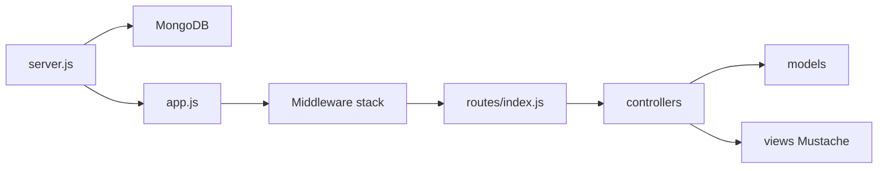

# Arquitetura

Visão geral de como a aplicação sobe, processa requisições e se organiza em camadas.

## Boot

O ponto de entrada é [`server.js`](../server.js):

1. Carrega variáveis de ambiente de `variable.env` (dotenv)
2. Conecta ao MongoDB (`DATABASE`)
3. Registra o modelo `Post`
4. Carrega o Express em [`app.js`](../app.js)
5. Escuta em `PORT` (padrão `7777`)

## Camadas

| Camada | Responsabilidade |
|--------|------------------|
| `routes/` | Declara métodos HTTP e paths; encadeia middlewares |
| `controllers/` | Lógica de negócio e renderização das views |
| `models/` | Schemas Mongoose (`User`, `Post`) |
| `middlewares/` | Auth e upload/redimensionamento de imagens |
| `handlers/` | E-mail (Nodemailer) e resposta 404 |
| `views/` | Templates Mustache (`.mst`) + partials |
| `helpers.js` | Título padrão e itens de menu |

Fluxo típico de uma requisição: middleware global em `app.js` → rota → (middlewares específicos) → controller → model e/ou view.

## Middleware global (`app.js`)

Ordem relevante:

1. `express.json` / `urlencoded`
2. Arquivos estáticos em `/public`
3. Cookie parser e sessão (`SECRET`)
4. Flash messages
5. Passport (initialize + session)
6. Locals de view (`h`, `flashes`, `user`, menu filtrado)
7. Router
8. Handler 404

Views usam Mustache (`mustache-express`), com partials em `views/partials/`.

## Autenticação

- Estratégia **Passport local** com e-mail como username (`passport-local-mongoose` no model `User`)
- Sessão via `express-session` (store em memória por padrão)
- Rotas protegidas usam `authMiddleware.isLogged`
- O menu em [`helpers.js`](../helpers.js) filtra itens por `guest` / `logged` conforme `req.isAuthenticated()`

## Upload de imagens

Em [`middlewares/imageMiddleware.js`](../middlewares/imageMiddleware.js):

1. Multer grava o arquivo em memória (`single('photo')`)
2. Aceita apenas JPEG/PNG
3. Jimp redimensiona para largura 800px
4. Salva em `public/media/` com nome UUID
5. Define `req.body.photo` com o nome do arquivo

Usado nas rotas POST de criação e edição de posts.

## E-mail

[`handlers/mailHandler.js`](../handlers/mailHandler.js) cria um transporter Nodemailer com as variáveis `SMTP_*` e exporta `send()` para o fluxo de recuperação de senha.

## Renderização

A aplicação é server-rendered (HTML via Mustache). Não há API JSON nem CLI.
