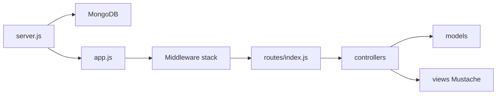

# Arquitetura

Visão geral de como a aplicação sobe, processa requisições e se organiza em camadas.

## Boot

O ponto de entrada é [`server.js`](../server.js):

1. Carrega variáveis de ambiente de `variable.env` (dotenv)
2. Conecta ao MongoDB (`DATABASE`)
3. Registra o modelo `Post`
4. Carrega o Express em [`app.js`](../app.js)
5. Escuta em `PORT` (padrão `7777`)

## Camadas

| Camada | Responsabilidade |
|--------|------------------|
| `routes/` | Declara métodos HTTP e paths; encadeia middlewares (auth, CSRF, rate limit, upload) |
| `controllers/` | Lógica de negócio e renderização das views |
| `models/` | Schemas Mongoose (`User`, `Post`) |
| `middlewares/` | Auth, CSRF e upload/redimensionamento de imagens |
| `handlers/` | E-mail (Nodemailer) e resposta 404 |
| `views/` | Templates Mustache (`.mst`) + partials |
| `helpers.js` | Título padrão e itens de menu |

Fluxo típico de uma requisição: middleware global em `app.js` → rota → (middlewares específicos) → controller → model e/ou view.

## Middleware global (`app.js`)

Ordem relevante:

1. Helmet (headers de segurança)
2. `express.json` / `urlencoded`
3. Arquivos estáticos em `/public`
4. Cookie parser e sessão (`SECRET`), com cookies `httpOnly`, `sameSite: lax` e `secure` quando `NODE_ENV=production`
5. Flash messages
6. Passport (initialize + session)
7. CSRF: gera token e expõe em `res.locals.csrfToken`
8. Locals de view (`h`, `flashes`, `user`, menu filtrado)
9. Router
10. Handler 404

Views usam Mustache (`mustache-express`), com partials em `views/partials/`.

## Autenticação

- Estratégia **Passport local** com e-mail como username (`passport-local-mongoose` no model `User`)
- Sessão via `express-session` (store em memória por padrão)
- No login, a sessão é **regenerada** antes de `req.login` (mitiga session fixation)
- Logout via **POST** `/users/logout` (com CSRF)
- Rotas protegidas usam `authMiddleware.isLogged`
- Alteração de senha exige a senha atual (`authMiddleware.changePassword`)
- O menu em [`helpers.js`](../helpers.js) filtra itens por `guest` / `logged`; o item “Sair” usa formulário POST (`post: true`)

## CSRF

Em [`middlewares/csrfMiddleware.js`](../middlewares/csrfMiddleware.js):

- `setCsrfToken` (global): guarda um secret na sessão e gera `csrfToken` para as views
- `validateCsrf` (nos POSTs): valida `_csrf` do body ou headers `csrf-token` / `x-csrf-token`
- Formulários incluem `<input type="hidden" name="_csrf" value="{{csrfToken}}"/>`

## Rate limit

Nas rotas de login, cadastro, “esqueci a senha” e reset: no máximo **10 requisições a cada 15 minutos** por IP (`express-rate-limit`).

## Upload de imagens

Em [`middlewares/imageMiddleware.js`](../middlewares/imageMiddleware.js):

1. Multer grava o arquivo em memória (`single('photo')`)
2. Aceita apenas JPEG/PNG; limite de **5MB**
3. Jimp redimensiona para largura 800px
4. Salva em `public/media/` com nome UUID
5. Define `req.body.photo` com o nome do arquivo

Usado nas rotas POST de criação e edição de posts (CSRF é validado após o Multer, para o token chegar via `multipart/form-data`).

## Autorização de posts

Criação associa `author` ao usuário logado. Edição e formulário de edição só funcionam se o post pertencer ao usuário autenticado (`slug` + `author`).

## E-mail

[`handlers/mailHandler.js`](../handlers/mailHandler.js) cria um transporter Nodemailer com as variáveis `SMTP_*` e exporta `send()` para o fluxo de recuperação de senha. O link de reset usa `APP_URL`.

A resposta ao pedido de reset é genérica (não revela se o e-mail existe).

## Renderização

A aplicação é server-rendered (HTML via Mustache). Não há API JSON nem CLI.
