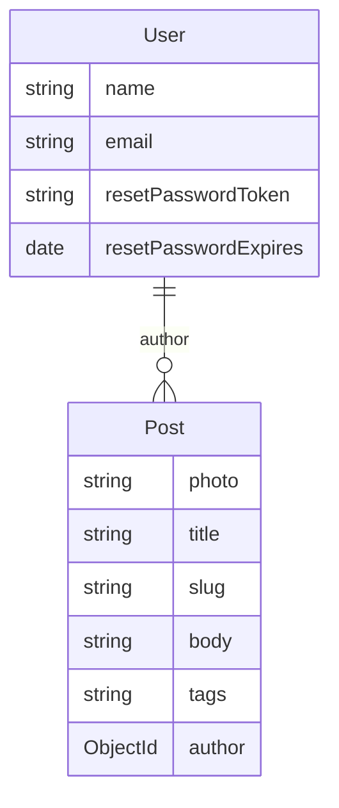

# Modelos

Schemas Mongoose em [`models/`](../models/).

## User

Arquivo: [`models/User.js`](../models/User.js)

| Campo | Tipo | Descrição |
|-------|------|-----------|
| `name` | String | Nome do usuário |
| `email` | String | Usado como username no login |
| `resetPasswordToken` | String | Token de recuperação de senha |
| `resetPasswordExpires` | Date | Validade do token |

Plugin **passport-local-mongoose** com `usernameField: 'email'`. Isso adiciona hash/salt de senha e métodos de autenticação (`authenticate`, `serializeUser`, `deserializeUser`, etc.), sem campos de senha explícitos no schema.

## Post

Arquivo: [`models/Post.js`](../models/Post.js)

| Campo | Tipo | Descrição |
|-------|------|-----------|
| `photo` | String | Nome do arquivo em `public/media/` |
| `title` | String | Obrigatório; trim |
| `slug` | String | Gerado a partir do título |
| `body` | String | Conteúdo do post |
| `tags` | `[String]` | Lista de tags |
| `author` | ObjectId → `User` | Autor do post |

### Hooks e estáticos

- **`pre('save')`**: se o título mudou, gera `slug` (lowercase) e, se já existir, acrescenta sufixo `-N` para unicidade.
- **`getTagsList()`**: aggregation que desagrupa tags, conta ocorrências e ordena por frequência.
- **`findPosts(filters)`**: `find` com `populate('author')`.

## Relação

